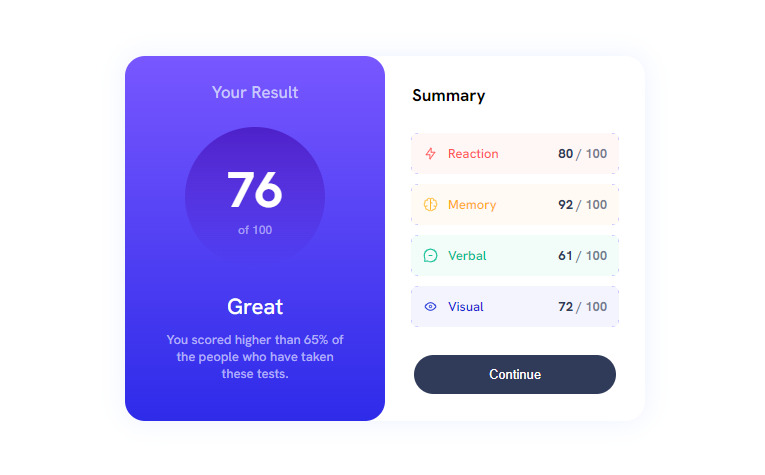

# Frontend Mentor - Results summary component solution

This is a solution to the [Results summary component challenge on Frontend Mentor](https://www.frontendmentor.io/challenges/results-summary-component-CE_K6s0maV). Frontend Mentor challenges help you improve your coding skills by building realistic projects. 

## Table of contents

- [Overview](#overview)
  - [The challenge](#the-challenge)
  - [Screenshot](#screenshot)
  - [Links](#links)
- [My process](#my-process)
  - [Built with](#built-with)
  - [What I learned](#what-i-learned)
  - [Continued development](#continued-development)
- [Author](#author)

## Overview

### The challenge

Users should be able to:

- View the optimal layout for the interface depending on their device's screen size
- See hover and focus states for all interactive elements on the page

### Screenshot

### Links

- Solution URL: [https://www.frontendmentor.io/solutions/solution-using-flexbox-media-queries-importing-data-with-json-w4a_fngaDw](https://www.frontendmentor.io/solutions/solution-using-flexbox-media-queries-importing-data-with-json-w4a_fngaDw)
- Live Site URL: [https://rock-n-roll-crc.github.io/results-summary-component/](https://rock-n-roll-crc.github.io/results-summary-component/)

## My process

### Built with
- Flexbox
- Media queries
- Importing data from the JSON file

### What I learned

While working on this challenge I learnt how to properly use media queries in responsive design, how to use TypeScript to import needed data from the JSON file.

### Continued development

In my future projects I want to be focusing on using dynamic HTML and responsive design techniques.

## Author

- Frontend Mentor - [Rock_n_Roll_CRC](https://www.frontendmentor.io/profile/Rock-n-Roll-CRC)
- Twitter - [@Rock_n_Roll_CRC](https://twitter.com/Rock_n_Roll_CRC)
